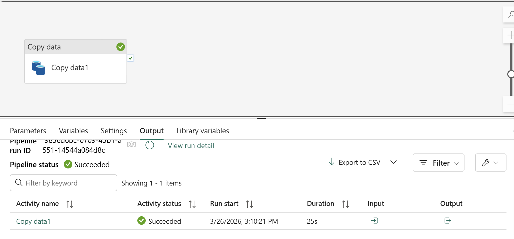
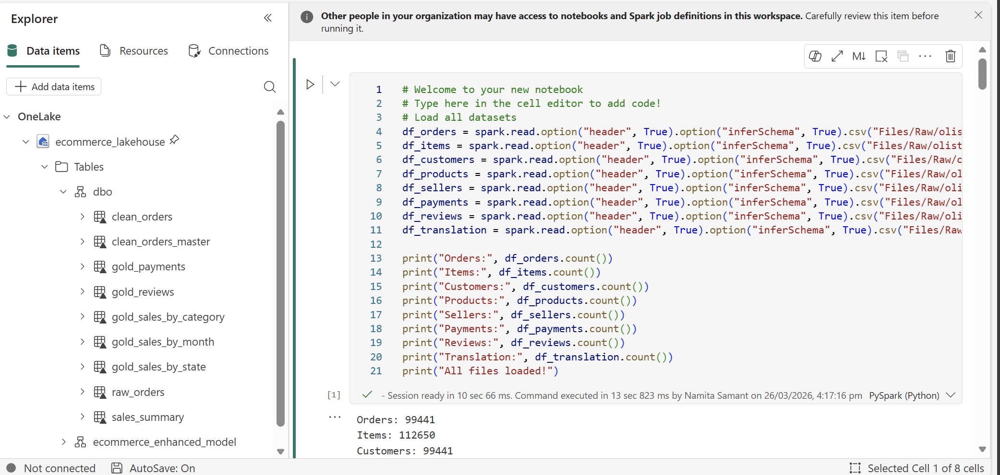
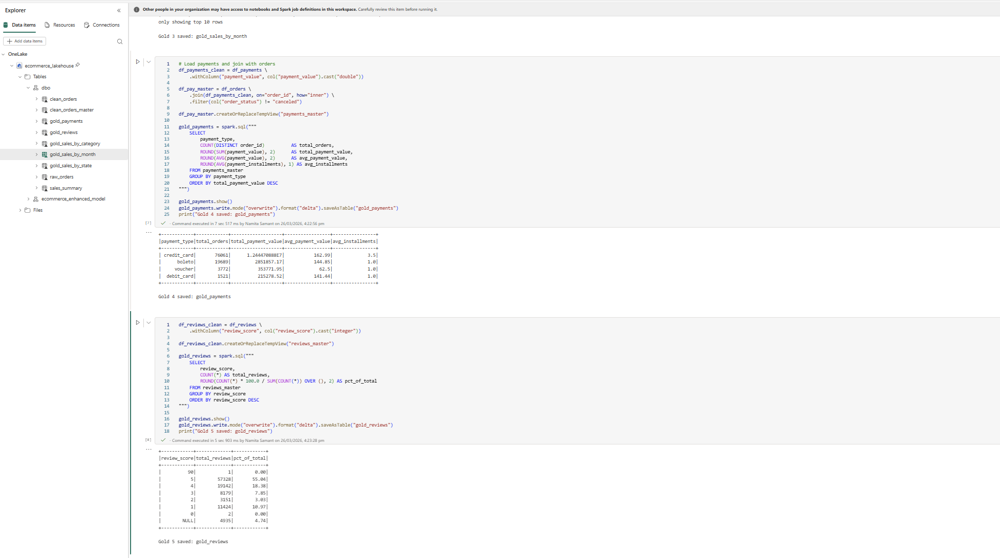
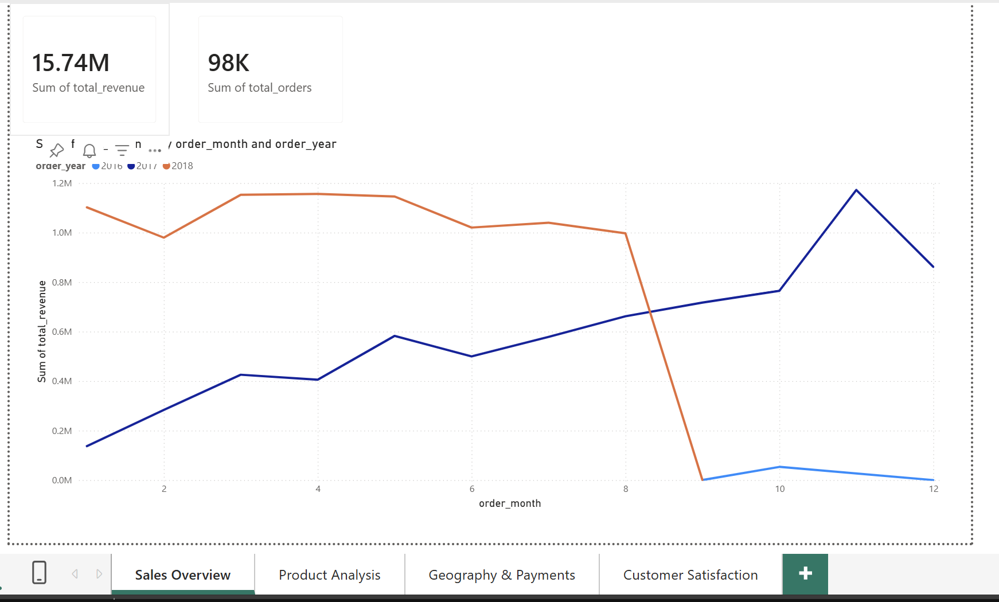
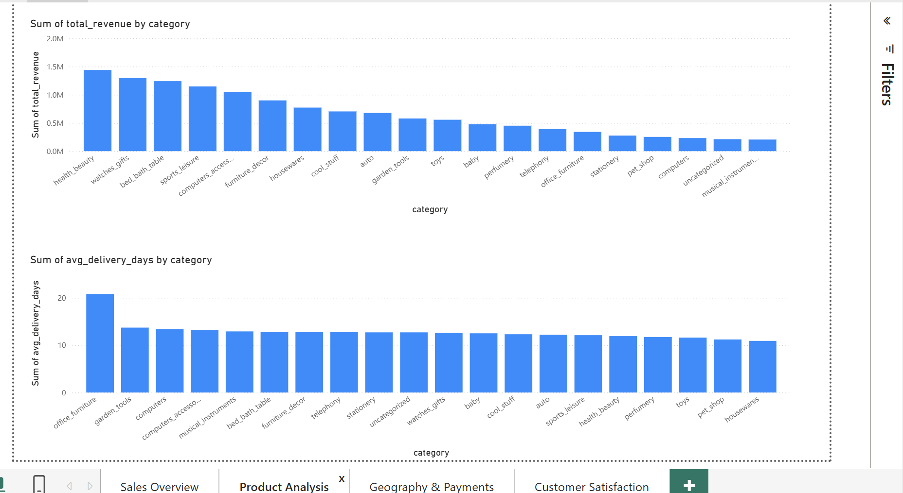
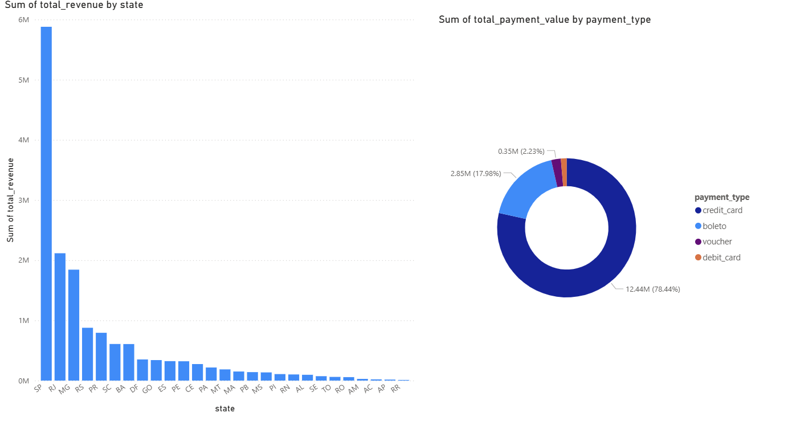
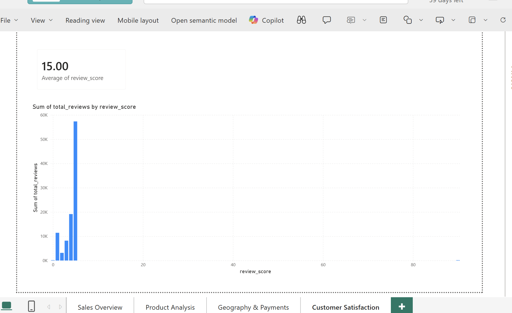

[fabric_readme.md](https://github.com/user-attachments/files/26569961/fabric_readme.md)
# End-to-End Data Engineering Project - Microsoft Fabric

Bronze Layer - Data Pipeline



Silver Layer - PySpark Transformation Notebook



Gold Layer - Delta Tables



Power BI Report - Revenue Trend



Power BI Report - Category Analysis



Power BI Report - State Analysis



Power BI Report - Customer Behaviour



## Project Overview
A complete end-to-end data engineering pipeline built as a personal side project using Microsoft Fabric. This project covers data ingestion, transformation, modelling and reporting all within a single unified platform using the Medallion Architecture (Bronze, Silver, Gold).

---

## Dataset
- **Source:** Olist Brazilian E-Commerce Dataset (Kaggle)(https://www.kaggle.com/datasets/olistbr/brazilian-ecommerce)
- **Size:** 100,000+ orders across 7 CSV files
- **Total Revenue Analysed:** 15.74M
- **Datasets included:**
  - Orders
  - Order Items
  - Order Payments
  - Order Reviews
  - Products
  - Customers
  - Product Category Name Translation

---

## Tools and Technologies
| Tool | Purpose |
|---|---|
| Microsoft Fabric | Unified data engineering platform |
| Fabric Lakehouse | Storage for Bronze, Silver and Gold layers |
| Data Pipeline (Copy Activity) | Raw data ingestion into Bronze layer |
| PySpark (Fabric Notebook) | Data transformation and feature engineering |
| Spark SQL | Building Gold layer Delta tables |
| Delta Tables | Business ready analytical tables |
| Power BI (Direct Lake) | Reporting and visualisation |

---

## Architecture - Medallion Architecture

```
Raw CSV Files
     |
     v
Bronze Layer  -->  Raw data ingested into Fabric Lakehouse via Data Pipeline
     |
     v
Silver Layer  -->  Cleaned, joined and enriched master table (112K rows) via PySpark
     |
     v
Gold Layer    -->  5 business ready Delta tables via Spark SQL
     |
     v
Power BI      -->  4 page report via Direct Lake connection
```

---

## Project Breakdown

### Bronze Layer - Data Ingestion
- Ingested 7 raw CSV files into the Fabric Lakehouse
- Used a Data Pipeline with Copy Activity to load raw files as-is
- No transformations at this layer raw data preserved

### Silver Layer - Data Transformation
Used PySpark in a Fabric Notebook to:
- Join all 7 datasets into one master table (112,000 rows)
- Engineer new columns:
  - `total_revenue` calculated order revenue
  - `delivery_days` days between order and delivery
  - `is_late` flag for orders delivered past estimated date
- Cast correct data types for all columns
- Filter and remove bad/null data

### Gold Layer - Business Ready Delta Tables
Built 5 Delta tables using Spark SQL:

| Table | Description |
|---|---|
| sales_by_category | Sales aggregated by product category (English) |
| sales_by_state | Sales aggregated by Brazilian state |
| monthly_revenue_trend | Revenue trends by month and year |
| payment_type_breakdown | Distribution of payment methods |
| review_score_distribution | Customer review score analysis |

### Power BI Report (4 pages - Direct Lake)
- Revenue Trend : 2018 grew significantly vs 2017
- Category Analysis : Health and Beauty top category at 1.5M
- State Analysis : Sao Paulo dominates all Brazilian states
- Customer Behaviour : 8% credit card payments, 55% five star reviews

---

## Key Insights
- Health and Beauty drives the most revenue across all product categories
- Sao Paulo generates 5x more revenue than any other Brazilian state
- 78% of all payments are made via credit card
- 55% of customers give a 5 star review indicating high satisfaction
- Office Furniture has the longest average delivery time at 20+ days a supply chain opportunity

---

## Repository Structure
```
microsoft-fabric-data-engineering
 ┣ notebooks/
 ┃ ┣ silver_transformation.ipynb     -- PySpark transformation notebook
 ┃ ┣ gold_delta_tables.ipynb         -- Spark SQL Gold layer notebook
 ┣ screenshots/
 ┃ ┣ bronze_pipeline.png             -- Data Pipeline screenshot
 ┃ ┣ silver_notebook.png             -- PySpark Notebook screenshot
 ┃ ┣ gold_tables.png                 -- Gold Delta tables screenshot
 ┃ ┣ powerbi_report.png              -- Power BI report screenshot
 ┣ README.md                         -- Project documentation
```

---

## How to Reproduce
1. Download the Olist dataset from Kaggle
2. Create a Fabric Lakehouse and upload the 7 CSV files
3. Create a Data Pipeline with Copy Activity to ingest files into Bronze layer
4. Run the Silver layer notebook to transform and join the data
5. Run the Gold layer notebook to create the 5 Delta tables
6. Connect Power BI using Direct Lake mode to the Gold layer tables

---

## Author
**[Namita Samant]**
Data Analyst | Data Engineer | Power BI | PySpark | Microsoft Fabric | DAX | SQL
LinkedIn: [www.linkedin.com/in/namita-samant-2706b3129]
GitHub: [https://github.com/namitasamant6]
